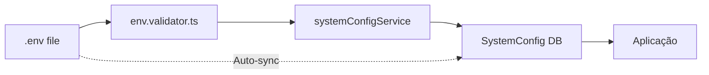

# Sistema de Persistência de Configurações

## Visão Geral

O WhatsSelf utiliza um sistema dual de configurações para garantir flexibilidade e persistência:

1. **Arquivo `.env`** - Configurações iniciais (bootstrap)
2. **Tabela `SystemConfig`** - Configurações em runtime (persistentes)

## Como Funciona

### Fluxo de Configurações



### Inicialização

1. **Na primeira execução:**
   - As configurações são lidas do `.env`
   - São validadas pelo `env.validator.ts`
   - São salvas no banco de dados (tabela `SystemConfig`)
   - A aplicação usa as configurações do banco

2. **Nas execuções seguintes:**
   - As configurações são carregadas do banco de dados
   - Em modo desenvolvimento: sincronização automática do `.env` a cada 5 segundos
   - Em produção: apenas configurações do banco são usadas

## Sincronização Automática

### Modo Desenvolvimento

Em desenvolvimento, o sistema verifica automaticamente mudanças no arquivo `.env` a cada 5 segundos e sincroniza com o banco:

```javascript
// Habilitado automaticamente em desenvolvimento
// apps/backend/src/server.ts
if (env.NODE_ENV === 'development') {
    configSyncService.startAutoSync(5000);
}
```

### Comandos Disponíveis

```bash
# Inicializa configurações do .env para o banco (primeira vez)
npm run config:init

# Sincroniza mudanças do .env com o banco (manualmente)
npm run config:sync
```

## Campos de Configuração

### Campos Criptografados

Os seguintes campos são criptografados no banco de dados:
- `jwtSecret`
- `defaultAdminPassword`

### Campos Principais

| Campo | Tipo | Descrição | Exemplo |
|-------|------|-----------|---------|
| `SKIP_WHATSAPP` | Boolean | Desabilita WhatsApp | `false` |
| `RATE_MAX_PER_MIN` | Number | Limite de mensagens/min | `12` |
| `RATE_PER_CONTACT_PER_5MIN` | Number | Limite por contato/5min | `2` |
| `BUSINESS_HOURS` | String | Horário comercial | `09:00-18:00` |
| `TIMEZONE` | String | Fuso horário | `America/Sao_Paulo` |
| `HUMANIZER_MIN_DELAY_MS` | Number | Delay mínimo humanização | `3000` |
| `HUMANIZER_MAX_DELAY_MS` | Number | Delay máximo humanização | `7000` |

### Configurações WhatsApp

| Campo | Tipo | Descrição |
|-------|------|-----------|
| `PUPPETEER_EXECUTABLE_PATH` | String | Caminho do Chrome/Edge |
| `PUPPETEER_HEADLESS` | Boolean | Modo headless |
| `WHATS_SESSION_PATH` | String | Diretório da sessão |

## API de Configuração

### Endpoint GET /config

Retorna as configurações atuais (mascaradas):

```bash
curl -H "Authorization: Bearer TOKEN" http://localhost:3001/config
```

### Endpoint PUT /config

Atualiza configurações em runtime:

```bash
curl -X PUT http://localhost:3001/config \
  -H "Authorization: Bearer TOKEN" \
  -H "Content-Type: application/json" \
  -d '{
    "skipWhatsapp": false,
    "rateMaxPerMin": 15
  }'
```

## Prioridade das Configurações

1. **Configurações via API** - Maior prioridade
2. **Configurações no banco** - Prioridade média
3. **Arquivo .env** - Menor prioridade (apenas bootstrap)

## Sincronização em Produção

Em produção, recomenda-se:

1. **Desabilitar auto-sync** - Por segurança
2. **Usar API** - Para mudanças de configuração
3. **Backup regular** - Do banco de dados

## Resolução de Problemas

### Configurações não aplicam

1. **Verifique o banco:**
```bash
npm run db:studio
# Veja a tabela SystemConfig
```

2. **Force sincronização:**
```bash
npm run config:sync
```

3. **Reinicie o servidor:**
```bash
# Pare com CTRL+C e reinicie
npm run dev
```

### Conflito entre .env e banco

```bash
# Força reset do banco para valores do .env
npm run config:init
```

### WhatsApp não inicia mesmo com SKIP_WHATSAPP=false

```bash
# Sincronize configurações
cd apps/backend
npm run config:sync

# Ou reinicie tudo
npm run db:reset
npm run config:init
npm run dev
```

## Boas Práticas

1. **Desenvolvimento:**
   - Use `.env` para configurações locais
   - Auto-sync está habilitado
   - Mudanças aplicam automaticamente

2. **Produção:**
   - Configure uma vez via `.env`
   - Use API para mudanças runtime
   - Nunca exponha `CONFIG_CRYPTO_KEY`

3. **Segurança:**
   - Mantenha `.env` fora do git
   - Use senhas fortes para admin
   - Troque `JWT_SECRET` regularmente

## Exemplo de Fluxo Completo

```bash
# 1. Configure .env
echo "SKIP_WHATSAPP=false" >> .env
echo "RATE_MAX_PER_MIN=20" >> .env

# 2. Em desenvolvimento (auto-sync ativo)
npm run dev
# Mudanças no .env aplicam em 5 segundos

# 3. Em produção (sync manual)
npm run config:sync
npm run start:prod

# 4. Via API (em runtime)
curl -X PUT http://localhost:3001/config \
  -H "Authorization: Bearer TOKEN" \
  -d '{"rateMaxPerMin": 25}'
```

## Arquivos Relacionados

- `/apps/backend/.env` - Configurações locais
- `/apps/backend/src/services/systemConfigService.ts` - Gerenciamento de config
- `/apps/backend/src/services/configSyncService.ts` - Sincronização automática
- `/apps/backend/src/config/env.validator.ts` - Validação de ambiente
- `/apps/backend/prisma/schema.prisma` - Schema do SystemConfig