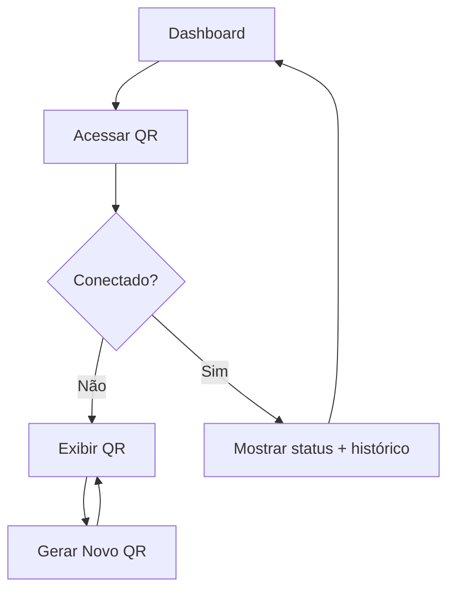
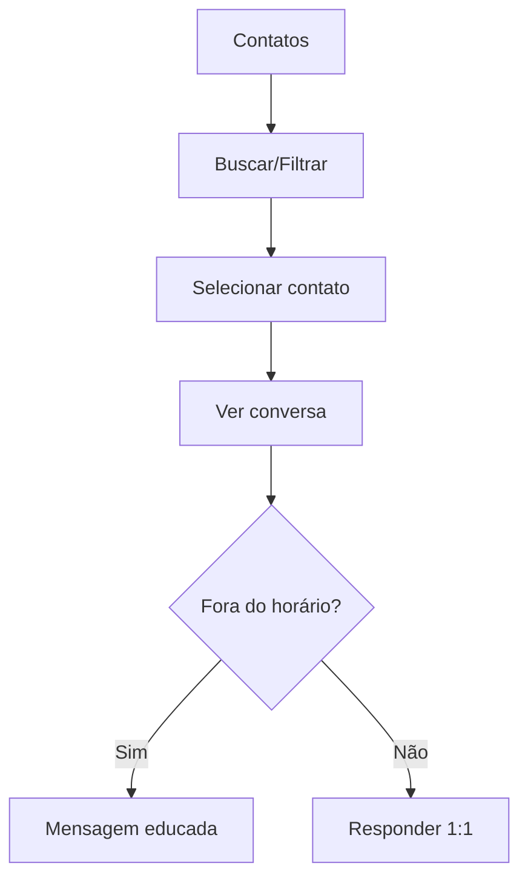
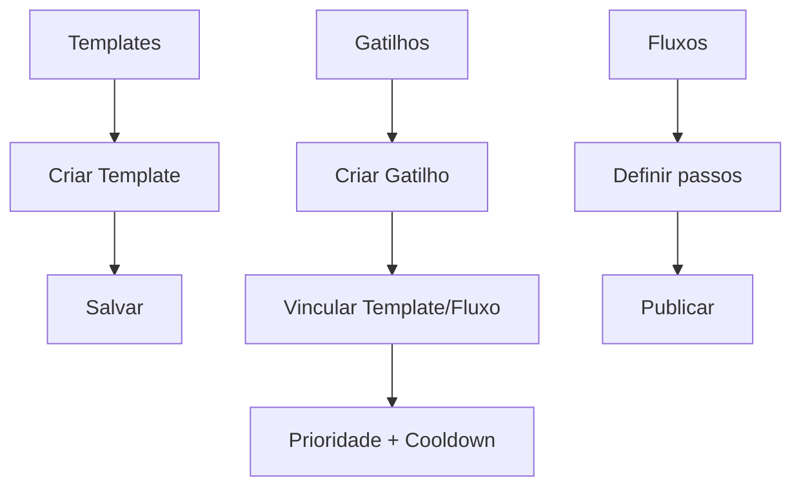

# Fluxos de UX – WhatsSelf

Modelos de fluxo para as principais tarefas. Referência visual do protótipo em `WhatsSelf/`.

## Conectar WhatsApp (QR)


Estados e regras
- Offline: botão “Gerar Novo QR”, instruções passo a passo.
- Online: informações de sessão ativa e histórico.
- Erros: banner com retry e logs mínimos.

## Procurar contato e responder


Estados e regras
- Opt-out: destacar e desabilitar automações para o contato.
- Sem nome: exibir “Sem nome” e permitir edição posterior.

## Criar Template → Gatilho → Fluxo


Critérios
- Template com `variants` e placeholders.
- Gatilho com tipo, padrão, prioridade, cooldown, destino.
- Fluxo com passos `send_template|collect_input|end`, transições e ordem.

## Simular gatilho/fluxo
```mermaid
flowchart TD
  S1[Simulador] --> S2[Informar texto + contato]
  S2 --> S3[Executar simulação]
  S3 --> S4{Match?}
  S4 -- Não --> S5[Mostrar "sem match"]
  S4 -- Sim --> S6[Exibir gatilho + ações do fluxo]
```

Critérios
- Mostrar trigger casado, instância de fluxo e ações `send_text/end_flow`.
- Útil para depurar regras antes de enviar mensagens reais.

## Opt-out detectado
```mermaid
flowchart TD
  O1[Inbound: "PARAR/SAIR/CANCELAR"] --> O2[Marcar opt-out]
  O2 --> O3[Silenciar contato]
  O3 --> O4[Registrar evento]
```

Regras
- Nunca enviar mensagens automáticas após opt-out.
- Mostrar tag “Opt-out” nos contatos.

